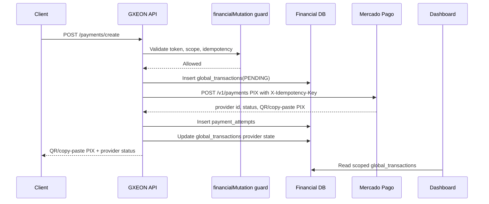
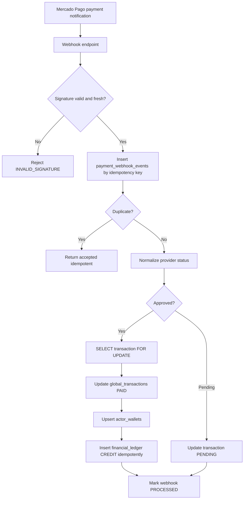

# Mercado Pago Flow Map — Mission 05

**Mission:** 05 — Mercado Pago Readiness Protocol  
**Status:** AUDIT_ONLY  
**Date:** 2026-06-02  
**Restrictions observed:** no real credentials, no external API connections, no real payments, no external webhooks, no production environment changes, no real keys stored.

## 1. Executive flow verdict

**Checkout/Pix Flow Readiness:** **92 / 100**

GXEON has a coherent local architecture for Mercado Pago PIX checkout: API guarded creation, transaction persistence, provider attempt persistence, webhook idempotency, approved-payment ledger settlement, and dashboard reads over `global_transactions`. Mission 05 added local webhook replay hardening by requiring fresh signed timestamps and blocking unsigned webhook bypasses in production.

## 2. Runtime components audited

| Component | Role | Readiness |
|---|---|---:|
| `server/runtime/paymentRuntime.cjs` | Builds local transaction input, persists `global_transactions`, calls Mercado Pago adapter, persists `payment_attempts`, updates provider state. | 92 |
| `server/runtime/mercadoPagoAdapter.cjs` | Masks credentials, validates required env shape, normalizes provider status, creates PIX charges and reads payment status. | 90 |
| `server/runtime/mercadoWebhookRuntime.cjs` | Validates webhook signature, enforces idempotency, optionally fetches provider status, applies approved payment to wallet/ledger. | 93 |
| `server/runtime/financialDb.cjs` | Transactional persistence for global transactions, payment attempts, webhook events, wallet settlement, ledger entries. | 94 |
| `server/runtime/revenueEngineRuntime.cjs` | Creates revenue checkouts for subscription, credit pack and marketplace flows using PIX. | 88 |
| `server/runtime/subscriptionRuntime.cjs` | Activates subscription from approved payment in local memory model. | 82 |
| `artifacts/api-server/src/routes/runtime.ts` | Exposes payment, webhook and revenue routes behind financial mutation guards. | 91 |

## 3. Payment creation flow

### Creation requirements

| Requirement | Current state | Gate |
|---|---|---|
| Amount validation | Positive numeric amount enforced locally. | Pass |
| Actor mapping | `actor_id` derived from input/metadata, fallback exists. | Pass with recommendation to remove production fallback. |
| Idempotency | Provider idempotency key and DB unique indexes exist. | Pass |
| Persistence before provider call | Transaction is inserted before PIX provider call. | Pass |
| Provider response capture | QR, copy-paste PIX, ticket URL and raw response persisted in attempt. | Pass |
| Real call prevention in this mission | No payment creation command was executed. | Pass |

## 4. Payment approval flow

## 5. Rejection, cancellation and expiration flow

| Provider state | Normalized state | Current local behavior | Required production behavior |
|---|---|---|---|
| `rejected` | `FAILED` | Normalization exists in adapter. | Persist transaction status `FAILED`; no wallet/ledger credit. |
| `cancelled`/`canceled` | `FAILED` | Normalization exists in adapter. | Persist `CANCELED` or `FAILED` consistently; record audit event. |
| `expired` | `EXPIRED` | Normalization exists in adapter. | Persist `EXPIRED`; trigger recovery only if policy allows. |
| `refunded`/`charged_back` | `REFUNDED` | Normalization exists in adapter. | Add debit/refund ledger entry and reverse entitlements. |
| `pending`/`in_process` | `PENDING` | Webhook updates transaction pending when transaction id is known. | Continue follow-up/recovery without crediting wallet. |

## 6. PIX-specific flow

| Step | Contract |
|---|---|
| Create charge | `payment_method_id = pix`, amount, payer email, external reference and metadata. |
| Present payment | Return `qrCode`, `qrCodeBase64`, `copyPastePix`, `ticketUrl`. |
| Confirm payment | Webhook validates signature, normalizes provider state and settles only approved payment. |
| Ledger update | `financial_ledger` receives one idempotent `CREDIT` entry per approved provider payment. |
| Dashboard update | Dashboard reads `global_transactions` and wallet/ledger summaries after persistence. |

## 7. Event mapping

| Event/action | Financial state | Ledger impact | Subscription impact | Dashboard impact |
|---|---|---|---|---|
| `payment.created` / pending | `PENDING` | None | None | Shows pending checkout. |
| `payment.updated` approved | `PAID` | Credit wallet and ledger. | Activate if plan metadata maps to subscription plan. | Shows paid revenue. |
| `payment.updated` rejected | `FAILED` | None | None | Shows failed payment. |
| `payment.updated` expired | `EXPIRED` | None | None | Shows expired/abandoned. |
| `payment.updated` refunded | `REFUNDED` | Future debit/refund ledger required. | Future entitlement reversal required. | Shows refund risk until implemented. |

## 8. Flow recommendations

1. Add explicit provider-status persistence for rejected/canceled/expired/refunded events.
2. Remove fallback `agent_buyer_1` for production settlement and require actor identity.
3. Add refund/chargeback debit ledger entries before enabling high-volume production.
4. Add local contract tests for provider status normalization and webhook replay rejection.
5. Keep payment creation behind `financialMutation` and service-side Mercado Pago credentials only.
