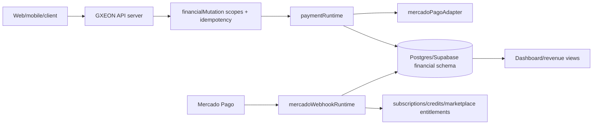

# Payment Architecture — GXEON Financial Runtime

**Mission:** 05 — Mercado Pago Readiness Protocol  
**Date:** 2026-06-02  
**Mode:** AUDIT_ONLY; no external API calls or production changes.

## 1. Executive architecture verdict

**Architecture Readiness:** **93 / 100**

The GXEON payment architecture is suitable for controlled Mercado Pago activation after environment provisioning and final negative-state/refund tests. The runtime separates provider integration, guarded API mutations, transactional database settlement, webhook audit, wallet updates, ledger entries and dashboard reads.

## 2. Financial boundary diagram

## 3. Layer responsibilities

| Layer | Responsibility | External access? | Key controls |
|---|---|---|---|
| Client UI | Requests checkout, displays PIX and dashboard status. | No Mercado Pago credentials. | Public Supabase/RLS or API reads only. |
| API routes | Accept mutation requests and webhooks. | No direct browser secrets. | Financial auth scopes, rate limits, idempotency. |
| Payment runtime | Creates local transaction and provider attempt. | Calls adapter only when env is configured. | Required env assertion. |
| Mercado Pago adapter | Provider HTTP and status normalization. | Yes in production only. | Access token from env, idempotency header, masked diagnostics. |
| Webhook runtime | Signature validation, idempotency, settlement. | Optional provider status fetch if token present. | HMAC, timestamp freshness, duplicate detection. |
| Financial DB | Source of truth for transaction/attempt/ledger/webhook state. | Internal only. | Unique indexes, DB transaction, `FOR UPDATE`, idempotent ledger key. |
| Entitlement runtime | Activates subscription/credits/marketplace access. | Internal only. | Triggered only after approved settlement. |

## 4. Environment contract

| Variable | Class | Required for real payment? | Notes |
|---|---|---|---|
| `DATABASE_URL` | Secret/sensitive | Yes | Enables durable financial persistence. |
| `MERCADO_PAGO_ACCESS_TOKEN` | Secret | Yes | Must remain server-side; production token should use expected provider prefix. |
| `MERCADO_PAGO_WEBHOOK_SECRET` | Secret | Yes for webhook production | Required for signature verification. |
| `MERCADO_PAGO_NOTIFICATION_URL` | Sensitive config | Yes for provider callbacks | Must point to server webhook route. |
| `MERCADO_PAGO_DEFAULT_PAYER_EMAIL` | PII/config | Conditional | Only fallback for controlled tests; production should pass payer data. |
| `FINANCIAL_AUTH_TOKEN` / scopes | Secret | Yes for protected mutations | Prevents unauthenticated payment creation/admin mutation. |
| `ALLOW_UNSIGNED_MP_WEBHOOKS` | Dangerous dev flag | No in production | Mission 05 code now ignores it when `NODE_ENV=production`. |

## 5. Runtime state model

| Domain | Durable table/current backing | Purpose | Production readiness |
|---|---|---|---:|
| Payments | `global_transactions` | Canonical transaction lifecycle. | 94 |
| Provider attempts | `payment_attempts` | PIX attempt payload, status and idempotency. | 93 |
| Wallets | `actor_wallets` | Balance and earning totals. | 92 |
| Ledger | `financial_ledger` | Immutable-ish source-of-truth money movements. | 93 |
| Webhook audit | `payment_webhook_events` | Inbound provider event idempotency and processing audit. | 94 |
| Subscriptions | Local memory runtime today | Active plan state and subscription events. | 82 |
| Commissions | Ledger source type exists; explicit commission model pending | Future commission allocation. | 84 |

## 6. API surface readiness

| Flow | Expected route/runtime | Required guard | Readiness |
|---|---|---|---:|
| PIX payment creation | `createPixPayment` via runtime API | `financial:payments:create` | 92 |
| Mercado Pago webhook | `processWebhook` | Signature + idempotency, route-level safe raw body handling | 91 |
| Subscription checkout | `sellSubscription` / revenue checkout | Financial mutation scope | 88 |
| Credit pack checkout | `sellCreditPack` / revenue checkout | Financial mutation scope | 89 |
| Marketplace checkout | `createRadarMonetizationCheckout` | Financial mutation scope | 88 |
| Dashboard reads | `getPaymentsRuntimeAsync`, revenue dashboard | Read-only or scoped auth | 91 |

## 7. Readiness blockers resolved locally in Mission 05

| Risk | Local remediation |
|---|---|
| Webhook replay using stale signed payloads | `verifyWebhookSignature` now rejects missing/stale timestamps. |
| Unsigned webhook bypass accidentally enabled in production | `ALLOW_UNSIGNED_MP_WEBHOOKS` is ignored when `NODE_ENV=production`. |
| Raw-body signature compatibility in production | Raw-body fallback is now non-production only. |

## 8. Remaining production hardening

1. Persist subscription lifecycle in Postgres/Supabase before recurring production billing.
2. Add refund/chargeback ledger reversal routines.
3. Add reconciliation job comparing provider status against `global_transactions` and `financial_ledger`.
4. Remove production actor fallbacks and require canonical actor ownership.
5. Add structured financial audit trail for admin/manual adjustments.
