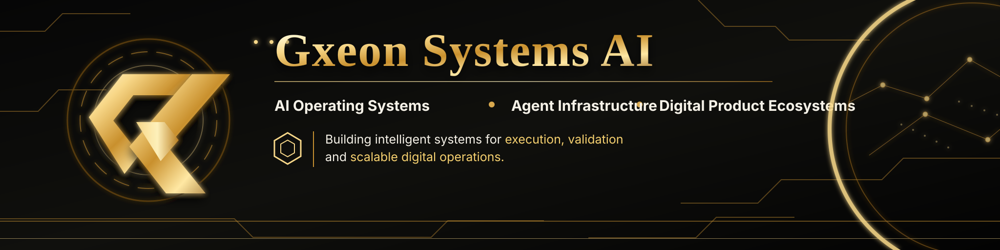
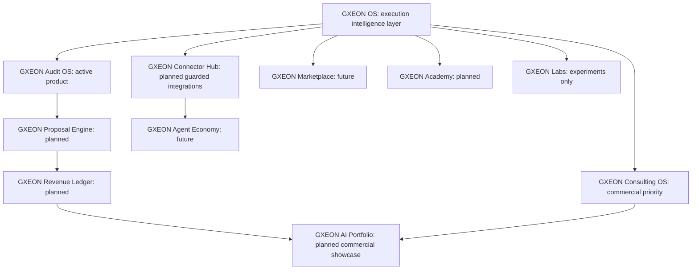
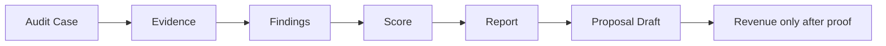
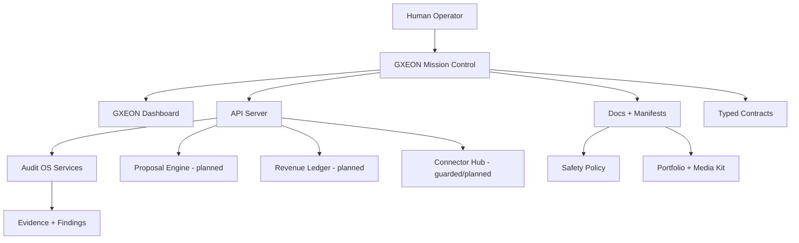

# GXEON OS

<div align="center">



## GXEON OS by Gxeon Systems AI — Execution intelligence for AI-powered digital operations


## Execution intelligence for AI-powered digital operations

**Conversa vira comando. Comando vira código. Código vira sistema. Sistema vira produto. Produto vira receita com prova.**


</div>

---

## Executive Summary

**GXEON OS**, by **Gxeon Systems AI**, is an operating layer for AI-assisted digital execution: it captures signals, organizes opportunities, prepares missions, generates code and documentation, validates evidence, supports proposals, and tracks monetization only when proof exists.
**GXEON OS** is an operating layer for AI-assisted digital execution: it captures signals, organizes opportunities, prepares missions, generates code and documentation, validates evidence, supports proposals, and tracks monetization only when proof exists.

The project is intentionally **manual-first**, **preview-first**, **safe-by-default**, and **evidence-led**. It does not claim confirmed revenue, customers, investors, autonomous production execution, or unrestricted connector writes unless those states are proven and documented.

The current active product line is **GXEON Audit OS**, a workflow for auditing digital assets, collecting evidence, producing findings, and turning validated work into reports and proof-based offers.

---

## Why GXEON Exists

AI can answer questions, but operators still need a controlled system that turns ideas into execution without losing safety, traceability, or commercial discipline. GXEON OS exists to connect the missing layer between conversation, code, deployment, evidence, proposals, and revenue validation.

GXEON is built for founders, freelancers, agencies, technical operators, early SaaS teams, and collaborators who need an auditable command center instead of disconnected prompts, spreadsheets, and manual follow-up.

---

## Core Operating Loop

```text
Idea → Mission → Code → Pull Request → Deploy → Evidence → Report → Proposal → Proof-Based Revenue
```

**Rule:** revenue is not counted until there is manual proof or an approved secure integration. Planned offers, forecasts, and opportunities remain labeled as planned, projected, or unconfirmed.

---

## Ecosystem Map



The reusable source diagram lives at [`public/assets/gxeon/diagrams/gxeon-os-ecosystem-diagram.mmd`](public/assets/gxeon/diagrams/gxeon-os-ecosystem-diagram.mmd).

---

## What Is Already Real

| Area | Honest status | Proof in repository |
| --- | --- | --- |
| GXEON OS repository structure | Active scaffold | Monorepo folders, contracts, docs, modules |
| GXEON Audit OS | Current active product line | Audit-oriented modules and documentation |
| Safety posture | Active policy | Manual-first, preview-first, no-secrets rules |
| Documentation system | Active | Brand, investor, portfolio, security and roadmap docs |
| TypeScript workspace | Active | pnpm workspace with build/typecheck scripts |
| Investor/portfolio kit | Active documentation asset | Docs and SVG assets in this repository |

---

## What Is Planned

These items are roadmap targets, not claimed production capabilities:

| Planned module | Intended role | Status label |
| --- | --- | --- |
| Proposal Engine | Convert reports into proposals and offer drafts | Planned |
| Revenue Ledger | Track forecasted, accepted, confirmed, and verified revenue | Planned |
| Connector Hub | Guarded integrations with explicit scope and approval gates | Planned |
| Academy | Playbooks, tutorials, training, and implementation materials | Planned |
| Marketplace | Templates, agents, flows, and automation packages | Future |
| SaaS | Subscription product for operators, freelancers, and agencies | Future |
| Agent Economy | Permissioned agent workflows with evidence and human approval | Future |

---

## Current Product: GXEON Audit OS

GXEON Audit OS is the first official product line. It is designed to audit websites, repositories, APIs, deploys, funnels, automations, and digital operations with evidence-first reporting.



**Golden rule:** no evidence, no report; no accepted proposal, no revenue; no proof, no monetization claim.

---

## Business Model

Initial monetization is service-led and proof-based:

| Offer | Starting target | Status |
| --- | ---: | --- |
| Auditoria Expressa GXEON | R$100 | Planned offer / proof-based |
| Auditoria Técnica Completa | R$300 | Planned offer / proof-based |
| Auditoria + Correções Assistidas | R$500+ | Planned offer / proof-based |
| Setup IA Operacional | R$700+ | Commercial package planned |
| GXEON Consulting OS | R$1500+ | Commercial priority |

These are initial package targets. They are not counted as revenue until real scope, customer agreement, delivery evidence, and payment proof exist.

---

## Investor-Readable Roadmap

| Phase | Milestone | Investor-readable outcome |
| --- | --- | --- |
| P0 | Foundation | Repository, contracts, safety policy, docs, brand and portfolio kit |
| P1 | Audit OS | Evidence-led audit workflow and report foundation |
| P2 | Proposal Engine | Report-to-offer conversion with human approval |
| P3 | Revenue Ledger | Proof-required monetization tracking |
| P4 | Portfolio + Consulting OS | Public showcase and service packaging |
| P5 | Academy | Repeatable training and playbooks |
| P6 | Connector Hub | Scoped integrations with preview/write guards |
| P7 | Marketplace | Sellable templates, agents, and workflows |
| P8 | SaaS | Subscription platform layer |
| P9 | Agent Economy | Governed agent execution with permissions and evidence |

---

## Live Architecture



---

## Safety and Trust

GXEON OS follows a strict operational honesty policy:

* **Manual-first:** sensitive actions start with the operator.
* **Preview-first:** the system prepares previews before execution.
* **Read-only first:** connectors start with limited read or preview capability.
* **Fail closed:** unsafe or missing configuration blocks execution.
* **No fake revenue:** planned offers and forecasts are not revenue.
* **No fake clients:** prospects, pilots, and templates are not customers.
* **No fake investors:** interest is not represented as investment.
* **No secrets in frontend:** service role keys, database URLs, and tokens must never be committed.
* **No production writes without mission:** external writes require explicit scope and approval.

---

## Portfolio and Media Kit

| Resource | Link |
| --- | --- |
| Brand Kit | [`docs/gxeon-os/brand/GXEON_BRAND_KIT.md`](docs/gxeon-os/brand/GXEON_BRAND_KIT.md) |
| Investor Brief | [`docs/gxeon-os/investors/GXEON_INVESTOR_BRIEF.md`](docs/gxeon-os/investors/GXEON_INVESTOR_BRIEF.md) |
| One Pager | [`docs/gxeon-os/investors/GXEON_ONE_PAGER.md`](docs/gxeon-os/investors/GXEON_ONE_PAGER.md) |
| Pitch Narrative | [`docs/gxeon-os/pitch/GXEON_PITCH_NARRATIVE.md`](docs/gxeon-os/pitch/GXEON_PITCH_NARRATIVE.md) |
| Portfolio Showcase | [`docs/gxeon-os/portfolio/GXEON_AI_PORTFOLIO_SHOWCASE.md`](docs/gxeon-os/portfolio/GXEON_AI_PORTFOLIO_SHOWCASE.md) |
| LinkedIn Kit | [`docs/gxeon-os/social/LINKEDIN_PROFILE_KIT.md`](docs/gxeon-os/social/LINKEDIN_PROFILE_KIT.md) |
| Launch Posts | [`docs/gxeon-os/social/LINKEDIN_LAUNCH_POSTS.md`](docs/gxeon-os/social/LINKEDIN_LAUNCH_POSTS.md) |
| Media Kit | [`docs/gxeon-os/media-kit/MEDIA_KIT.md`](docs/gxeon-os/media-kit/MEDIA_KIT.md) |
| Honest Metrics | [`docs/gxeon-os/metrics/HONEST_METRICS.md`](docs/gxeon-os/metrics/HONEST_METRICS.md) |
| Asset Registry | [`docs/gxeon-os/assets/ASSET_REGISTRY.md`](docs/gxeon-os/assets/ASSET_REGISTRY.md) |

---

## Repository Structure

```text
artifacts/                 API server, dashboard, mobile and prototype apps
docs/gxeon-os/             GXEON OS institutional, technical and product docs
packages/gxeon-contracts/  Typed contracts and ecosystem policy sources
public/assets/gxeon/       Official SVG, social and Mermaid assets
scripts/                   Governance, validation and deployment helper scripts
```

---

## APIs Read-Only do Ecossistema

```http
GET /api/v1/gxeon/ecosystem
GET /api/v1/gxeon/products
GET /api/v1/gxeon/roadmap
GET /api/v1/gxeon/safety-policy
```

These routes must not execute production writes, call payment providers, create webhooks, scrape external sites, or return secrets.

---

## Como Rodar Localmente

> Ajuste os comandos conforme o workspace ativo. Não use credenciais reais em arquivos versionados.

```bash
pnpm install
pnpm run typecheck:libs
pnpm --filter @workspace/api-server run build
PORT=3000 BASE_PATH=/ pnpm --filter @workspace/gxeon-dashboard run build
```

### Variáveis de ambiente

Crie arquivos locais ignorados pelo Git. Nunca commite `.env` real.

```env
NODE_ENV=development
PORT=3000
SUPABASE_URL=...
SUPABASE_ANON_KEY=...
GXEON_AUDIT_DB_PROVIDER=supabase_rest
GXEON_AUDIT_WRITE_MODE=preview_only
GXEON_AUDIT_ALLOW_DB_WRITES=false
GXEON_AUDIT_OPERATOR_TOKEN=...
GXEON_AUDIT_MISSION_RUNNER_TOKEN=...
```

### Regras de ambiente

```text
- Use valores reais apenas em provedores seguros.
- Não cole segredos em issues, PRs ou README.
- Não coloque chaves privilegiadas no frontend.
- Não tire print de tela com token visível.
```

---

## Documentation Index

| Documento | Função |
| --- | --- |
| `docs/gxeon-os/GXEON_OS_MASTER_BLUEPRINT.md` | Blueprint mestre do ecossistema. |
| `docs/gxeon-os/GXEON_ECOSYSTEM_MANIFEST.json` | Manifesto estruturado em JSON. |
| `docs/gxeon-os/products/PRODUCT_INDEX.md` | Índice de produtos oficiais, labs e verticais. |
| `docs/gxeon-os/roadmaps/ROADMAP_2026.md` | Roadmap oficial. |
| `docs/gxeon-os/security/SAFETY_POLICY.md` | Política de segurança. |
| `docs/gxeon-os/monetization/MONETIZATION_MAP.md` | Mapa de monetização. |
| `docs/gxeon-os/architecture/GXEON_OS_ARCHITECTURE_MAP.md` | Arquitetura do sistema. |
| `docs/gxeon-os/showcase/SHOWCASE_INDEX.md` | Índice de demos, screenshots seguros e provas públicas. |

---

## For Investors / Partners

GXEON OS is looking for strategic partners, early technical collaborators, pilot clients, and support to turn a safety-first execution operating system into scalable products. The best next step is to review the investor brief, one-pager, honest metrics document, and portfolio showcase before discussing pilots or partnerships.

**CTA:** open a focused conversation around one of three tracks: Audit OS pilots, implementation consulting, or technical collaboration for the next product modules.

---

## No-Secrets Policy

Never commit real environment values, private URLs, tokens, database URLs, service role keys, payment credentials, customer data, or screenshots that expose secrets. Public documentation must use placeholders only.

---

## Operational Honesty Notice

This project is in active development. Some modules are active, some are planned, some are future, and some are labs. GXEON OS does not promise guaranteed income, fully autonomous production execution, unrestricted scraping, payment automation without approved integration, confirmed revenue without proof, or connector writes without explicit mission scope.

---

## License

Project in development by **xpex-systems-ai**. Usage, distribution and commercial opening must follow the repository maintainer policy.

<div align="center">

## GXEON OS

**Capturar sinais. Organizar oportunidades. Executar com segurança. Validar com evidência. Monetizar com prova. Escalar com agentes.**

</div>
