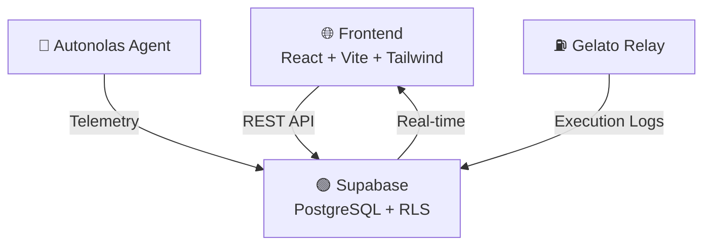

# 🌐 GXeon AI: Unified Telemetry & Infrastructure

   

> **Live Command Center:** [gxeon-ai-hg53.vercel.app](https://gxeon-ai-hg53.vercel.app/)

## ⚡ Overview
GXeon AI is a decentralized command center and infrastructure dashboard designed for monitoring **Autonomous AI Agents** (Autonolas ecosystem) and **Automated Smart Contract Executions** (Gelato Network). 

It provides real-time, visual telemetry for decentralized physical infrastructure networks (DePIN) and agentic workflows, lowering the barrier to entry for operators who need to track yields, AI decisions, and task statuses in real-time.

## 🚀 Core Features
* **🧠 Autonolas Brain Telemetry:** Real-time tracking of AI task resolution (NLP, Market Prediction) and ecosystem rewards.
* **🎯 Gelato Sniper Monitoring:** Visual tracking of automated zero-gas executions across multiple chains (Polygon, Base, Arbitrum).
* **🔒 Secure Cloud Infrastructure:** Powered by Supabase PostgreSQL with strict Row Level Security (RLS) policies.
* **⚡ Real-Time Edge Rendering:** Built with React/Vite and deployed on Vercel's global edge network.

## 🏗️ System Architecture



## 🛠️ Tech Stack
- **Frontend:** React 18, Vite, Tailwind CSS, Lucide Icons.
- **Backend/DB:** Supabase (PostgreSQL), REST API.
- **Web3 Integrations:** Autonolas (Olas) Agents, Gelato Web3 Functions.

## 📦 Quick Start (Local Deployment)

1. **Clone the repository:**
   ```bash
   git clone https://github.com/xpex-systems-ai/xzeon-xpex.git
   cd xzeon-xpex
   ```

2. **Install dependencies:**
   ```bash
   npm install
   ```

3. **Configure environment:**
   ```bash
   cp .env.example .env
   # Edit .env with your Supabase credentials
   ```

4. **Start development server:**
   ```bash
   npm run dev
   ```

---

## 📜 License

MIT License - See [LICENSE](LICENSE) for details.

## 🤝 Contributing

Contributions are welcome! Please read our [Contributing Guide](CONTRIBUTING.md) for details on our code of conduct and development process.

## 📞 Support

For support, email gxeon.ai@gmail.com or join our Discord community.
