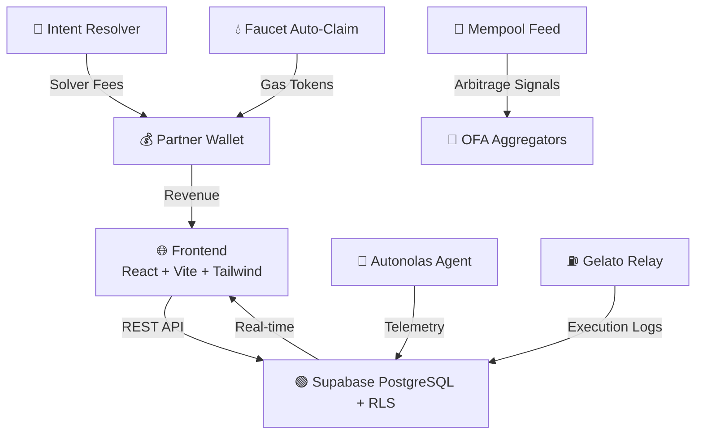

<div align="center">

# � GXeon AI Enterprise Gold v2.0
### Autonomous Intent Solving & Gasless Engine

[](https://github.com/xpex-systems-ai/GXEON-AI/releases)
[](LICENSE)
[](https://github.com/xpex-systems-ai/GXEON-AI/actions)
[](https://gxeon-enterprise-gold.netlify.app)

**Live Command Center:** [gxeon-enterprise-gold.netlify.app](https://gxeon-enterprise-gold.netlify.app) | **Local:** [http://localhost:3002](http://localhost:3002)

</div>

---

## 🚀 Overview

GXeon AI Enterprise Gold is a **decentralized command center** and **infrastructure dashboard** designed for monitoring **Autonomous AI Agents** and **Automated Smart Contract Executions**. 

**v2.0 New Features:**
- 🧠 **Autonomous Intent Solving** - CoW Protocol & PropellerHeads integration for route calculation monetization
- 💰 **Affiliate Mining** - Partner fee injection across all DEX routes
- 💧 **Faucet Auto-Claim** - Automated gas token collection from developer incentive networks
- 📡 **Mempool Arbitrage Feed** - Web3_Global_Mempool integration for arbitrage signal capture and OFA intent selling

It provides real-time, visual telemetry for decentralized physical infrastructure networks (DePIN) and agentic workflows, lowering the barrier to entry for operators who need to track yields, AI decisions, and task statuses in real-time.

## 🏆 Core Features

### 🧠 Autonomous Intent Solving
- **CoW Protocol Solver** - Compute optimal routing paths and earn solver fees
- **PropellerHeads Integration** - Advanced intent resolution for complex swaps
- **Partner Fee Monetization** - 0.3% commission on all routed transactions

### 💎 Revenue Generation
- **Affiliate Mining** - Wallet `0x3955d559055DadB7067054cB6E6f974710345224` as beneficiary across all DEX routes
- **OFA Integration** - Sell intents to Order Flow Auction aggregators (0x, 1inch, Paraswap)
- **Mempool Arbitrage** - Capture signals and sell to highest bidder

### ⚡ Gasless Operations
- **Faucet Auto-Claim** - Automated gas token collection from Polygon, Arbitrum, Optimism, Linea, Scroll
- **Zero-Gas Executions** - Gelato Network integration for automated smart contract calls
- **Flashbots Protection** - MEV protection via private mempool

### 🔒 Secure Infrastructure
- **Supabase PostgreSQL** - Row Level Security (RLS) policies
- **Multi-Chain Support** - Ethereum, Arbitrum, Polygon, Base, Optimism
- **Real-Time Telemetry** - Autonolas Brain Telemetry and Gelato monitoring

## 🏗️ System Architecture



## 🛠️ Tech Stack

### Frontend
- **React 18** - UI framework with hooks and context
- **Vite** - Lightning-fast build tool and dev server
- **Tailwind CSS** - Utility-first CSS framework
- **Lucide React** - Beautiful icon library
- **React Router DOM** - Client-side routing
- **Ethers.js** - Web3 library for blockchain interactions

### Backend & Infrastructure
- **Supabase** - PostgreSQL database with Row Level Security (RLS)
- **Node.js** - Server runtime for core agents
- **Express** - REST API server
- **Hardhat** - Ethereum development framework
- **Solidity** - Smart contract language

### Web3 Integrations
- **CoW Protocol** - Intent-based DEX aggregation
- **PropellerHeads** - Advanced routing solver
- **0x API** - Order Flow Auction aggregator
- **1inch API** - DEX aggregation protocol
- **Paraswap** - Multi-chain DEX aggregator
- **Gelato Network** - Automated smart contract execution
- **Autonolas (Olas)** - Autonomous AI agent framework

### Deployment
- **Netlify** - Global edge deployment
- **Vercel** - Alternative edge deployment
- **Docker** - Containerization support
- **GitHub Actions** - CI/CD pipeline

## 📦 Quick Start

### Option 1: Docker Deployment (Recommended)

```bash
# Build and run with Docker Compose
docker-compose up -d

# View logs
docker-compose logs -f

# Stop services
docker-compose down
```

### Option 2: Local Development

1. **Clone the repository:**
   ```bash
   git clone https://github.com/xpex-systems-ai/GXEON-AI.git
   cd GXEON-AI
   ```

2. **Install dependencies:**
   ```bash
   npm install
   cd dashboard && npm install
   ```

3. **Configure environment:**
   ```bash
   cp .env.example .env
   # Edit .env with your Supabase credentials and Web3 keys
   ```

4. **Start development server:**
   ```bash
   # Backend server (port 3000)
   npm start

   # Dashboard (port 3002)
   cd dashboard && npm run dev
   ```

5. **Start revenue modules:**
   ```bash
   # Intent Resolver
   node core/intent_resolver_agent.js

   # Affiliate Mining
   node core/affiliate_miner.js

   # Faucet Auto-Claim
   node core/faucet_auto_claim.js

   # Mempool Arbitrage Feed
   node core/mempool_arbitrage_feed.js
   ```

## 🐳 Docker Deployment

### Docker Compose Configuration

```yaml
version: '3.8'
services:
  app:
    build: .
    ports:
      - "3000:3000"
    environment:
      - NODE_ENV=production
      - SUPABASE_URL=${SUPABASE_URL}
      - SUPABASE_SERVICE_ROLE_KEY=${SUPABASE_SERVICE_ROLE_KEY}
    volumes:
      - ./core:/app/core
      - ./contracts:/app/contracts
    restart: unless-stopped

  dashboard:
    build: ./dashboard
    ports:
      - "3002:80"
    environment:
      - VITE_GXEON_VAULT_ADDRESS=${VITE_GXEON_VAULT_ADDRESS}
      - VITE_API_URL=${VITE_API_URL}
    depends_on:
      - app
    restart: unless-stopped
```

### Build Custom Image

```bash
# Build the application
docker build -t gxeon-ai:gold-v2.0 .

# Run the container
docker run -d -p 3000:3000 \
  -e SUPABASE_URL=your_supabase_url \
  -e SUPABASE_SERVICE_ROLE_KEY=your_key \
  gxeon-ai:gold-v2.0
```

## 🚢 Deployment

### Netlify Deployment

```bash
# Build dashboard
cd dashboard
npm run build

# Deploy to Netlify
netlify deploy --prod --dir=dist
```

### Vercel Deployment

```bash
# Install Vercel CLI
npm i -g vercel

# Deploy
vercel --prod
```

## 📜 License

**Private Enterprise License** - See [LICENSE](LICENSE) for details.

This software is proprietary and confidential. All rights reserved.

## 🤝 Contributing

Contributions are welcome! Please read our [Contributing Guide](CONTRIBUTING.md) for details on our code of conduct and development process.

## 📞 Support

For support, email gxeon.ai@gmail.com or join our Discord community.

---

<div align="center">

**Built with ❤️ by GXeon AI Team**

[](https://github.com/xpex-systems-ai/GXEON-AI)
[](https://github.com/xpex-systems-ai/GXEON-AI/fork)
[](https://github.com/xpex-systems-ai/GXEON-AI/issues)

</div>
