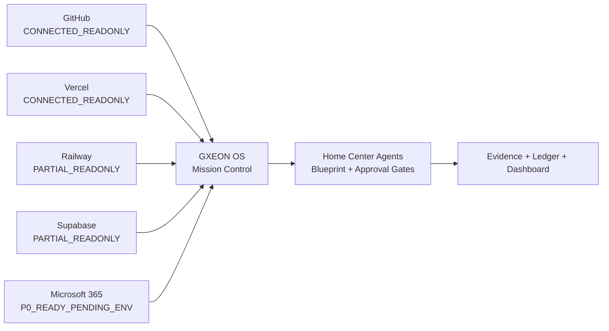
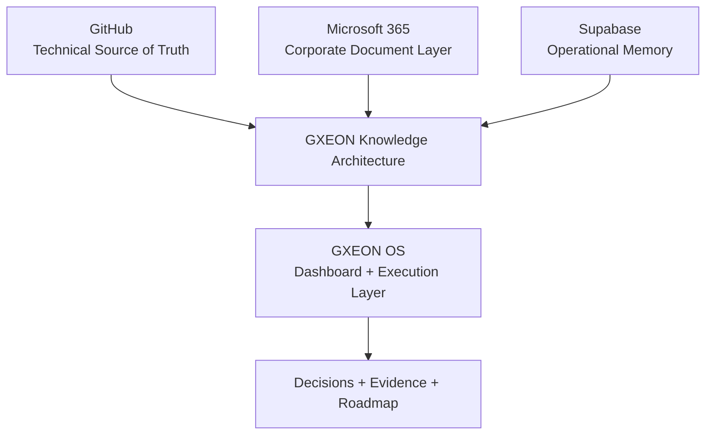
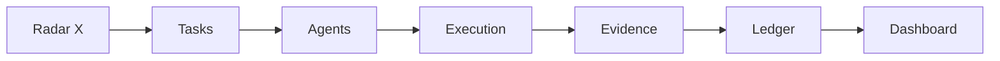

# GXEON OS

## Sistema Operacional de Operações Digitais

**Captura • Executa • Monetiza**

_The operating system for digital operations, agent execution and monetized intelligence._

GXEON OS é o **Sistema Operacional de Operações Digitais** para transformar sinais, tarefas, agentes, evidências e monetização em um fluxo único de comando. Este repositório é o centro institucional, técnico e operacional do GXEON: documenta arquitetura, conectores, segurança, memória, agentes e roadmap sem expor credenciais, prometer autonomia inexistente ou inflar status de produção.

---

## Mission Control snapshot

| Domínio | Estado atual | Papel operacional | Regra de segurança |
| --- | --- | --- | --- |
| GitHub | `CONNECTED_READONLY` | Código, PRs, Issues, ADRs | Fonte técnica de verdade; escrita via revisão humana. |
| Vercel | `CONNECTED_READONLY` | Interface, Deploy, Frontend | Observabilidade e publicação controlada. |
| Railway | `PARTIAL_READONLY` | Runtime, APIs, Workers, Logs | Parcial; não tratar como controle total. |
| Supabase | `PARTIAL_READONLY` | Memória, Storage, Eventos, Evidências | Parcial; service credentials somente no backend. |
| Microsoft 365 | `P0_READY_PENDING_ENV` | Email, Calendar, OneDrive, Documents | Conector P0 construído, pendente de ambiente aprovado. |
| Home Center Agents | `BLUEPRINT_READY` | Casa dos agentes e missões | Agentes propositivos antes de execução aprovada. |
| Security model | `READ_ONLY_FIRST` | Limites, auditoria e evidências | Sem segredos no frontend e fail closed. |

---

## O que é GXEON OS

GXEON OS é uma camada operacional para coordenar **operador humano + agentes de IA + infraestrutura conectada**. A proposta é capturar sinais operacionais, converter em tarefas, acionar agentes com permissões explícitas, anexar evidências, registrar decisões e preparar monetização com disciplina.

Não é apresentado como automação irrestrita. O estado atual prioriza leitura, auditoria, proposta e aprovação humana antes de qualquer ação destrutiva ou financeira.

---

## Core stack

| Camada | Provedor | Significado no GXEON |
| --- | --- | --- |
| Engenharia | GitHub | Repositórios, código, issues, pull requests, ADRs e histórico técnico. |
| Interface | Vercel | Dashboard, frontend, publicação e visualização do Mission Control. |
| Execução | Railway | Serviços, APIs, workers, runtime e logs operacionais. |
| Memória | Supabase | Eventos, evidências, storage, dados operacionais e trilhas de execução. |
| Comunicação | Microsoft 365 | Documentos, email, calendário, apresentações e operação humana. |
| Agentes | Home Center Agents | Papéis, missões, aprovações, evidências e execução governada. |

---

## GXEON Digital Operations OS

---

## Home Center Agents

**Home Center Agents** é a casa operacional dos agentes do GXEON. Cada agente possui missão, escopo, conectores permitidos, limites de leitura/escrita, aprovação humana e exigência de evidência. A visão inclui Code Agent, Deploy Agent, Ops Agent, Revenue Agent, Finance Agent, Security Agent, Grok Auditor Agent e Operator Agent.

A regra institucional é simples: agentes podem observar, explicar e propor; execução com impacto real exige aprovação, ambiente correto, rollback e prova anexada.

---

## Knowledge Architecture

A arquitetura de conhecimento separa código, documentos corporativos, eventos operacionais, evidências e decisões. Essa separação evita confundir intenção com produção, proposta com execução e evidência com segredo.

---

## Connector Topology

| Provider | Status | Papel | Boundary |
| --- | --- | --- | --- |
| GitHub | `CONNECTED_READONLY` | Engenharia, código, PRs, issues e ADRs | Leitura conectada; escrita somente por fluxo aprovado. |
| Vercel | `CONNECTED_READONLY` | Interface, dashboard, frontend e publicação | Leitura conectada; deploy tratado como operação controlada. |
| Railway | `PARTIAL_READONLY` | Runtime, serviços, workers, APIs e logs | Parcial; não declarar cobertura total. |
| Supabase | `PARTIAL_READONLY` | Memória, eventos, storage, evidências e dados | Parcial; credenciais sensíveis ficam no backend. |
| Microsoft 365 | `P0_READY_PENDING_ENV` | Documentos, email, calendário e apresentações | Pronto em P0, pendente de variáveis de ambiente aprovadas. |

---

## Operational Pipeline

1. **Radar X** captura sinais, oportunidades, riscos e demandas.
2. **Tasks** convertem sinais em trabalho priorizado.
3. **Agents** analisam, propõem e executam apenas quando autorizados.
4. **Execution** registra atividade controlada.
5. **Evidence** comprova resultado sem expor segredo.
6. **Ledger** organiza valor, custos, entregas e aprendizado.
7. **Dashboard** mostra estado operacional para decisão humana.

---

## Security Principles

- **No secrets in frontend:** credenciais nunca entram em código cliente, markdown público, screenshots ou logs commitados.
- **Backend-only credentials:** tokens, chaves e segredos vivem em provedores aprovados e rotas server-side.
- **Read-only first:** conectores começam como leitura antes de qualquer capacidade mutável.
- **Fail closed:** ausência de configuração segura bloqueia execução em vez de degradar permissões.
- **Human approval gates:** ações destrutivas, financeiras, deploys e escritas externas exigem aprovação.
- **Evidence and audit trail:** toda execução relevante deve gerar evidência segura e rastreável.

---

## Current Status

| Área | Estado | Observação honesta |
| --- | --- | --- |
| Repository presentation | `P0_UPGRADED` | Este repositório agora possui documentação institucional e operacional. |
| Connectors | `MIXED_READONLY` | GitHub e Vercel conectados em leitura; Railway e Supabase parciais; Microsoft 365 pendente de ambiente. |
| Home Center Agents | `BLUEPRINT` | Blueprint e roadmap documentados; não tratados como runtime autônomo final. |
| Monetization path | `DESIGNED` | Caminho documentado; receita deve ser registrada somente com evidência real. |
| Security model | `DOCUMENTED` | Políticas de backend-only, leitura primeiro e aprovação humana formalizadas. |

---

## Roadmap

| Fase | Nome | Resultado esperado |
| --- | --- | --- |
| P0 | Foundation | Repositório, arquitetura, segurança, conectores e narrativa alinhados. |
| P1 | Connector completion | Completar conectores parciais sem violar limites de segurança. |
| P2 | Memory and evidence | Consolidar memória operacional, evidências e decisões. |
| P3 | Home Center Agents | Ativar agentes de leitura/proposta com gates humanos. |
| P4 | Monetization | Conectar ofertas, checkout readiness, webhook e ledger real. |
| P5 | Agent Economy | Evoluir agentes para economia governada por permissões, auditoria e valor comprovado. |

---

## Documentation Index

| Documento | Finalidade |
| --- | --- |
| [Docs hub](docs/README.md) | Índice central da documentação GXEON OS. |
| [Manifesto](docs/manifesto/GXEON_MANIFESTO.md) | Missão, visão e princípios. |
| [System Architecture](docs/architecture/GXEON_SYSTEM_ARCHITECTURE.md) | Camadas, fluxos e diagrama técnico. |
| [Knowledge Architecture](docs/architecture/GXEON_KNOWLEDGE_ARCHITECTURE.md) | Árvore de conhecimento e fontes de verdade. |
| [Company Memory Map](docs/architecture/GXEON_COMPANY_MEMORY_MAP.md) | Onde cada memória corporativa vive. |
| [Connector Topology](docs/architecture/GXEON_CONNECTOR_TOPOLOGY.md) | Mapa de conectores, status e limites. |
| [Home Center Agents Blueprint](docs/agents/HOME_CENTER_AGENTS_BLUEPRINT.md) | Casa dos agentes, papéis e permissões. |
| [Home Center Agents Roadmap](docs/agents/HOME_CENTER_AGENTS_ROADMAP.md) | Fases de ativação governada. |
| [Connectors Overview](docs/connectors/GXEON_CONNECTORS_OVERVIEW.md) | Visão operacional dos conectores. |
| [Operational Playbook](docs/operations/GXEON_OPERATIONAL_PLAYBOOK.md) | Workflow do operador e validação. |
| [Security Model](docs/security/GXEON_SECURITY_MODEL.md) | Políticas de segurança e ações proibidas. |
| [Monetization Path](docs/monetization/GXEON_MONETIZATION_PATH.md) | Caminho Radar X até ledger e entrega. |
| [Master Roadmap](docs/roadmap/GXEON_MASTER_ROADMAP.md) | P0-P5 e status atual. |
| [Brand System](docs/brand/GXEON_BRAND_SYSTEM.md) | Voz, termos oficiais e tom. |
| [Assets](docs/assets/README.md) | Estrutura de placeholders visuais. |

---

## Operator Workflow

1. Abrir Mission Control e identificar sinais em Radar X.
2. Converter sinal em task com objetivo, owner, risco e critério de aceite.
3. Atribuir agente apenas com escopo e conector permitidos.
4. Exigir evidência segura antes de marcar execução como concluída.
5. Registrar decisão, impacto e rollback quando houver mudança operacional.
6. Atualizar ledger apenas com fatos verificáveis, nunca com promessa ou estimativa não rotulada.

---

## No-secrets policy

Este repositório não deve conter tokens, chaves privadas, client secrets, service role keys, arquivos de ambiente reais, URLs privadas ou screenshots com credenciais. Exemplos e templates devem usar nomes genéricos, sem valores reais. Qualquer credencial pertence ao backend, a um provedor de secrets ou a um ambiente local ignorado pelo Git.

---

## Manifesto final

> GXEON OS não é apenas um painel. É uma disciplina operacional: capturar o que importa, executar com controle, monetizar com evidência e governar cada decisão como memória viva da empresa.
