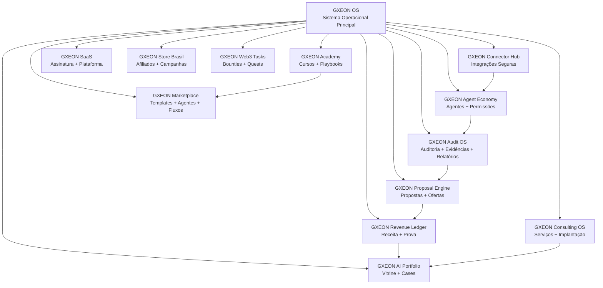
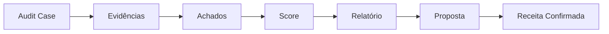
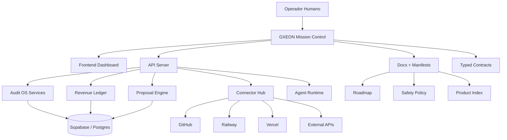
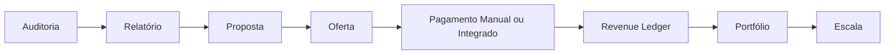

# GXEON OS

<div align="center">

## Sistema Operacional de Execução Inteligente, Auditoria, Agentes e Monetização Assistida

**Capturar sinais. Organizar oportunidades. Executar com segurança. Validar com evidência. Monetiza com prova. Escalar com agentes.**

<br />


</div>

---

## Visão Geral

**GXEON OS** é um sistema operacional privado para transformar ideias, sinais, tarefas, agentes, conectores, evidências, propostas e receita em um fluxo organizado, auditável e escalável.

Ele não é apenas um dashboard.

Ele é uma estrutura viva para construir, operar e monetizar sistemas digitais com apoio de IA, mantendo o operador humano no centro da decisão.

```text
Ideia → Missão → Código → Pull Request → Deploy → Evidência → Relatório → Proposta → Receita
```

O GXEON nasce como uma arquitetura **manual-first**, **preview-first**, **safe-by-default** e evolui para um ecossistema com agentes, conectores, memória operacional, automação assistida e produtos comerciais.

---

## O Que Este Repositório Representa

Este repositório é o **repositório-mãe oficial do ecossistema GXEON OS**.

Ele concentra:

* arquitetura do sistema operacional;
* produto oficial **GXEON Audit OS**;
* documentação estratégica;
* contratos tipados;
* políticas de segurança;
* roadmap técnico;
* módulos futuros;
* laboratórios comerciais;
* estrutura de agentes;
* conectores;
* camadas de monetização;
* base para produtos SaaS, marketplace, consulting e academy.

---

## Princípio Fundador

> **Nada executa sem consciência. Nada monetiza sem validação. Nada escala sem segurança.**

O GXEON não automatiza no escuro.

Ele prepara, recomenda, organiza, cria prévias, registra evidências e só avança quando existe controle, autorização e rastreabilidade.

---

## Ecossistema GXEON



---

## Produtos e Módulos

| Produto / Módulo          | Estado               | Função                                                                     |
| ------------------------- | -------------------- | -------------------------------------------------------------------------- |
| **GXEON OS**              | Core                 | Sistema operacional mestre do ecossistema.                                 |
| **GXEON Audit OS**        | Ativo                | Auditoria de sites, sistemas, GitHub, deploys, Supabase, APIs e funis.     |
| **GXEON Proposal Engine** | Próximo              | Transforma relatórios e achados em propostas comerciais.                   |
| **GXEON Revenue Ledger**  | Planejado            | Controla receita prevista, proposta, aceita, confirmada e verificada.      |
| **GXEON Agent Economy**   | Futuro               | Economia de agentes com missões, permissões e resultados.                  |
| **GXEON Marketplace**     | Futuro               | Loja de templates, agentes, fluxos, playbooks e automações.                |
| **GXEON Academy**         | Planejado            | Cursos, tutoriais, documentação e treinamentos.                            |
| **GXEON Connector Hub**   | Planejado            | Central segura para GitHub, Supabase, Railway, Vercel e outros conectores. |
| **GXEON SaaS**            | Futuro               | Produto por assinatura para operadores, freelancers e agências.            |
| **GXEON Consulting OS**   | Prioridade comercial | Serviços de implantação, auditoria e automação com IA.                     |
| **GXEON AI Portfolio**    | Prioridade comercial | Portfólio vivo de sistemas, cases, prints, demos e entregas.               |
| **GXEON Store Brasil**    | Laboratório          | Vertical de afiliados, Copa, Mercado Livre e campanhas comerciais.         |
| **GXEON Web3 Tasks**      | Laboratório          | Radar de bounties, quests, testnets, airdrops e recompensas Web3.          |

---

## Produto Oficial Atual: GXEON Audit OS

O **GXEON Audit OS** é a primeira linha de produto real do ecossistema.

Ele foi criado para transformar qualquer ativo digital em um caso de auditoria com evidências, achados, pontuação, relatório, proposta e potencial receita.

### Ele pode auditar

* sites;
* landing pages;
* e-commerces;
* repositórios GitHub;
* deploys Railway/Vercel;
* bancos Supabase;
* APIs;
* fluxos de IA;
* funis;
* checkout;
* SEO técnico;
* segurança básica;
* automações;
* presença digital.

### Fluxo operacional



### Regra de ouro

```text
Sem evidência, não há relatório.
Sem relatório, não há proposta.
Sem proposta aceita, não há receita.
Sem prova, não há monetização.
```

---

## Arquitetura Técnica



---

## Stack Principal

| Camada                  | Tecnologia / Provedor     | Papel                                                           |
| ----------------------- | ------------------------- | --------------------------------------------------------------- |
| Versionamento           | GitHub                    | Código, PRs, issues, histórico e fonte técnica de verdade.      |
| Execução de código      | Codex                     | Executor técnico, geração de branches, PRs, builds e correções. |
| Arquitetura / Auditoria | GX / ChatGPT              | Planejamento, auditoria, estratégia e missão operacional.       |
| Backend                 | API Server                | Rotas, serviços, contratos e lógica do sistema.                 |
| Frontend                | GXEON Dashboard           | Mission Control, painéis, módulos e operação visual.            |
| Deploy Backend          | Railway                   | Runtime da API e serviços.                                      |
| Deploy Frontend         | Vercel / Netlify          | Publicação e previews.                                          |
| Banco / Memória         | Supabase / Postgres       | Casos, evidências, relatórios, ledger e estado operacional.     |
| Documentação            | Markdown + JSON contracts | Memória institucional e técnica.                                |
| Segurança               | Safety Policy + Guards    | Preview-first, manual-first, no secrets, no fake revenue.       |

---

## Estrutura do Repositório

```text
.
├── artifacts/
│   ├── api-server/
│   │   └── src/modules/
│   │       ├── gxeon-os/
│   │       ├── audit-os/
│   │       ├── proposal-engine/
│   │       ├── revenue-ledger/
│   │       ├── connector-hub/
│   │       ├── agent-economy/
│   │       ├── marketplace/
│   │       ├── academy/
│   │       ├── consulting-os/
│   │       ├── ai-portfolio/
│   │       └── labs/
│   │
│   └── gxeon-dashboard/
│       └── src/modules/
│           ├── gxeon-os/
│           ├── audit-os/
│           ├── proposal-engine/
│           ├── revenue-ledger/
│           ├── connector-hub/
│           ├── agent-economy/
│           ├── marketplace/
│           ├── academy/
│           ├── consulting-os/
│           ├── ai-portfolio/
│           └── labs/
│
├── docs/
│   └── gxeon-os/
│       ├── manifests/
│       ├── products/
│       ├── modules/
│       ├── agents/
│       ├── connectors/
│       ├── monetization/
│       ├── security/
│       ├── roadmaps/
│       ├── architecture/
│       ├── portfolio/
│       └── labs/
│
├── packages/
│   ├── gxeon-contracts/
│   ├── gxeon-core/
│   ├── gxeon-agents/
│   ├── gxeon-connectors/
│   ├── gxeon-monetization/
│   ├── gxeon-products/
│   ├── gxeon-security/
│   ├── gxeon-observability/
│   └── gxeon-shared/
│
└── README.md
```

---

## APIs Read-only do Ecossistema

O módulo GXEON OS expõe endpoints seguros e estáticos para o ecossistema:

```http
GET /api/v1/gxeon/ecosystem
GET /api/v1/gxeon/products
GET /api/v1/gxeon/roadmap
GET /api/v1/gxeon/safety-policy
```

Essas rotas não executam escrita em produção, não chamam provedores externos e não retornam segredos.

---

## Contratos Oficiais

O repositório possui contratos para organizar o ecossistema:

```text
packages/gxeon-contracts/src/ecosystemManifest.ts
packages/gxeon-contracts/src/safetyPolicy.ts
docs/gxeon-os/GXEON_ECOSYSTEM_MANIFEST.json
docs/gxeon-os/security/SAFETY_POLICY.md
docs/gxeon-os/products/PRODUCT_INDEX.md
```

Esses contratos definem:

* produtos oficiais;
* laboratórios;
* módulos futuros;
* status operacional;
* estágios de monetização;
* políticas de segurança;
* dependências;
* próximas missões.

---

## Política de Segurança

O GXEON segue uma política de segurança rígida.

### Princípios

* **Manual-first:** toda ação sensível começa com o operador.
* **Preview-first:** o sistema cria prévias antes de executar.
* **Read-only first:** conectores começam em leitura.
* **Fail closed:** se não houver configuração segura, a ação é bloqueada.
* **No fake revenue:** receita falsa é proibida.
* **No fake clients:** clientes fictícios não entram como clientes reais.
* **No secrets in frontend:** segredos nunca vão para o cliente.
* **No connector writes without mission:** conectores só escrevem com missão explícita.
* **Evidence-first:** toda entrega relevante precisa de prova.

### Proibido

```text
- Commitar tokens.
- Expor DATABASE_URL.
- Expor service_role.
- Criar receita falsa.
- Criar clientes falsos.
- Chamar pagamento sem missão.
- Fazer scraping sem escopo.
- Escrever em conectores externos sem autorização.
- Tratar previsão como receita confirmada.
```

---

## Monetização

O GXEON monetiza por etapas.



### Primeiras ofertas comerciais

| Oferta               | Entrega                                   | Ticket inicial |
| -------------------- | ----------------------------------------- | -------------- |
| Auditoria Expressa   | Diagnóstico simples + evidências + resumo | R$100          |
| Auditoria Técnica    | Achados + score + relatório completo      | R$300          |
| Auditoria + Correção | Relatório + plano + ajustes assistidos    | R$500+         |
| Setup IA Operacional | Organização de automação, deploy e painel | R$700+         |
| Consulting OS        | Implantação estratégica com IA            | R$1500+        |

### Regra financeira

```text
Receita só é confirmada quando houver prova manual ou integração segura aprovada.
```

---

## Roadmap

| Fase | Nome                         | Resultado                                                                       |
| ---- | ---------------------------- | ------------------------------------------------------------------------------- |
| P0   | Foundation                   | Repositório, documentação, safety policy, contracts e estrutura do ecossistema. |
| P1   | Audit OS                     | Casos, evidências, achados, score e relatórios.                                 |
| P2   | Proposal Engine              | Relatório vira proposta comercial.                                              |
| P3   | Revenue Ledger               | Receita prevista, aceita, confirmada e verificada.                              |
| P4   | AI Portfolio + Consulting OS | Vitrine comercial e pacotes de serviço.                                         |
| P5   | Academy                      | Conteúdo, cursos, playbooks e treinamento.                                      |
| P6   | Connector Hub                | Integrações seguras com escopo limitado.                                        |
| P7   | Marketplace                  | Templates, agentes, automações e fluxos vendáveis.                              |
| P8   | SaaS                         | Produto por assinatura.                                                         |
| P9   | Agent Economy                | Economia governada de agentes e execução assistida.                             |

---

## Fluxo de Execução Oficial

Toda evolução do GXEON segue este ciclo:

```text
1. Diagnóstico
2. Auditoria
3. JSON de missão
4. Execução no Codex
5. Pull Request
6. Build / Typecheck / Testes
7. Merge
8. Deploy
9. Print / Prova
10. Auditoria do resultado
11. Próximo JSON
```

Nada deve ser feito no escuro.

Cada PR precisa ter:

* motivação;
* descrição;
* segurança;
* testes;
* limitações;
* próximos passos;
* relatório de execução.

---

## Papel dos Agentes

Os agentes do GXEON não nascem com poder total.

Eles evoluem por camadas:

```text
Observa → Recomenda → Prepara → Executa com aprovação → Registra evidência → Aprende
```

### Agentes planejados

| Agente           | Função                                        |
| ---------------- | --------------------------------------------- |
| Scout Agent      | Encontrar sinais, oportunidades e demandas.   |
| Analyst Agent    | Avaliar risco, valor, prioridade e esforço.   |
| Audit Agent      | Auditar ativos digitais.                      |
| Evidence Agent   | Organizar provas, prints, links e validações. |
| Proposal Agent   | Criar propostas, mensagens e ofertas.         |
| Revenue Agent    | Acompanhar previsões e receita confirmada.    |
| Deploy Agent     | Apoiar deploys e rollback com segurança.      |
| Security Agent   | Bloquear riscos, segredos e ações inseguras.  |
| Operator Copilot | Guiar o operador na próxima ação segura.      |

---

## Connector Hub

O Connector Hub organiza integrações por status e permissão.

| Status          | Significado                                     |
| --------------- | ----------------------------------------------- |
| `disabled`      | Conector desativado.                            |
| `read_only`     | Pode ler estado, mas não escreve.               |
| `preview_only`  | Pode gerar simulação ou proposta.               |
| `write_guarded` | Pode escrever apenas com autorização explícita. |
| `blocked`       | Bloqueado por segurança, env ausente ou risco.  |

### Conectores planejados

* GitHub;
* Railway;
* Vercel;
* Supabase;
* Mercado Pago;
* Mercado Livre;
* Google;
* Microsoft 365;
* OpenAI;
* OpenRouter;
* Hugging Face;
* Anthropic;
* Meta;
* WalletConnect;
* Webhooks internos.

---

## Como Rodar Localmente

> Ajuste os comandos conforme o workspace ativo. Não use credenciais reais em arquivos versionados.

```bash
pnpm install
pnpm run typecheck:libs
pnpm --filter @workspace/api-server run build
PORT=3000 BASE_PATH=/ pnpm --filter @workspace/gxeon-dashboard run build
```

### Variáveis de ambiente

Crie arquivos locais ignorados pelo Git. Nunca commite `.env` real.

```env
# API
NODE_ENV=development
PORT=3000

# Supabase / DB
SUPABASE_URL=...
SUPABASE_SERVICE_ROLE_KEY=...
GXEON_AUDIT_DB_PROVIDER=supabase_rest

# Audit OS guarded writes
GXEON_AUDIT_WRITE_MODE=preview_only
GXEON_AUDIT_ALLOW_DB_WRITES=false

# Tokens temporários de operador
GXEON_AUDIT_OPERATOR_TOKEN=...
GXEON_AUDIT_MISSION_RUNNER_TOKEN=...
```

### Regras de ambiente

```text
- Use valores reais apenas em provedores seguros.
- Não cole segredos em issues, PRs ou README.
- Não coloque service_role no frontend.
- Não tire print de tela com token visível.
```

---

## Status Atual

| Área                          | Estado           |
| ----------------------------- | ---------------- |
| GXEON OS repository structure | Scaffold criado  |
| GXEON Audit OS                | Produto ativo    |
| Evidence + Findings           | Instalado        |
| Score + Report runner         | Em estabilização |
| Proposal Engine               | Próximo módulo   |
| Revenue Ledger                | Planejado        |
| Ecosystem docs                | Criado           |
| Safety policy                 | Criada           |
| Product index                 | Criado           |
| Connector Hub                 | Planejado        |
| SaaS                          | Futuro           |
| Marketplace                   | Futuro           |
| Agent Economy                 | Futuro           |

---

## Documentação Principal

| Documento                                                 | Função                                         |
| --------------------------------------------------------- | ---------------------------------------------- |
| `docs/gxeon-os/GXEON_OS_MASTER_BLUEPRINT.md`              | Blueprint mestre do ecossistema.               |
| `docs/gxeon-os/GXEON_ECOSYSTEM_MANIFEST.json`             | Manifesto estruturado em JSON.                 |
| `docs/gxeon-os/products/PRODUCT_INDEX.md`                 | Índice de produtos oficiais, labs e verticais. |
| `docs/gxeon-os/roadmaps/ROADMAP_2026.md`                  | Roadmap oficial.                               |
| `docs/gxeon-os/security/SAFETY_POLICY.md`                 | Política de segurança.                         |
| `docs/gxeon-os/monetization/MONETIZATION_MAP.md`          | Mapa de monetização.                           |
| `docs/gxeon-os/architecture/GXEON_OS_ARCHITECTURE_MAP.md` | Arquitetura do sistema.                        |

---

## Manifesto

> GXEON OS é o QG operacional para transformar intenção em execução e execução em receita.

Ele não nasceu para ser apenas uma ferramenta.

Ele nasceu para ser uma estrutura viva:

* um cérebro operacional;
* uma fábrica de agentes;
* um radar de oportunidades;
* um pipeline de entrega;
* um livro de contas;
* um centro de comando;
* um ecossistema.

```text
GXEON OS — captar, organizar, executar, validar, monetizar e escalar com segurança.
```

---

## Aviso de Honestidade Operacional

Este projeto está em evolução ativa.

Alguns módulos são oficiais e ativos. Outros são planejados, futuros ou laboratórios. O repositório não deve apresentar capacidades futuras como se já estivessem em produção.

O GXEON não promete:

* dinheiro garantido;
* execução totalmente autônoma sem aprovação;
* scraping irrestrito;
* pagamentos automáticos sem integração aprovada;
* receita confirmada sem prova;
* conectores com escrita sem escopo seguro.

O GXEON promete:

* organização;
* clareza;
* arquitetura;
* prévias;
* segurança;
* rastreabilidade;
* evidência;
* evolução modular;
* execução assistida;
* caminho real para monetização.

---

## Licença

Projeto em desenvolvimento por **xpex-systems-ai**.

Uso, distribuição e abertura comercial devem seguir a política definida pelo mantenedor do repositório.

---

<div align="center">

## GXEON OS

**Conversa vira comando. Comando vira código. Código vira sistema. Sistema vira produto. Produto vira receita com prova.**

</div>
