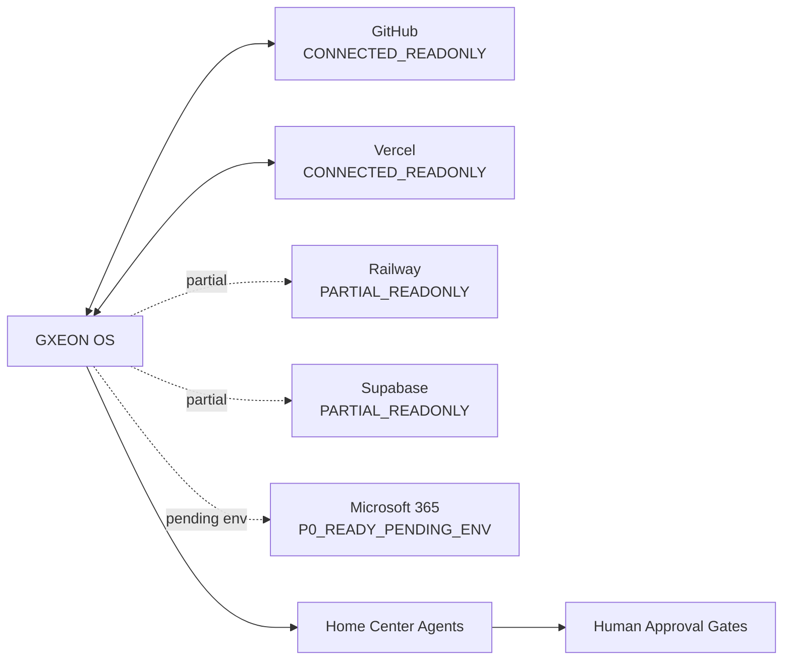

# GXEON Connector Topology

## Status atual dos conectores

| Conector | Status | Função | Fronteira atual |
| --- | --- | --- | --- |
| GitHub | `CONNECTED_READONLY` | Engenharia, código, PRs, issues e ADRs | Leitura conectada; escrita via Git e review humano. |
| Vercel | `CONNECTED_READONLY` | Interface, dashboard, frontend e publicação | Leitura conectada; deploys continuam controlados. |
| Railway | `PARTIAL_READONLY` | Runtime, serviços, workers, APIs e logs | Parcial; não assumir cobertura total de runtime. |
| Supabase | `PARTIAL_READONLY` | Memória, eventos, storage, evidências e dados | Parcial; backend-only para credenciais sensíveis. |
| Microsoft 365 | `P0_READY_PENDING_ENV` | Documentos, email, calendário e apresentações | Built pending approved environment variables. |

## Graph

## Read-only boundaries

- Conectores de leitura podem listar, resumir e auditar.
- Escrita externa, deploy, mutação de dados e operação financeira exigem aprovação explícita.
- Conectores parciais devem permanecer documentados como `PARTIAL_READONLY` até validação posterior.

## Backend-only secrets

Credenciais de provedores pertencem a runtimes server-side e secret stores. O frontend só pode receber dados já filtrados por APIs internas seguras.

## Future connector expansion

Expansões futuras devem seguir: threat model, escopo mínimo, modo leitura, validação, evidência, aprovação e só então capacidade mutável limitada.
