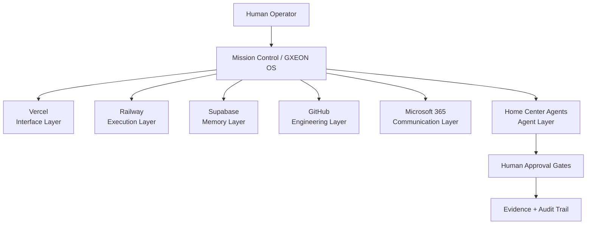

# GXEON System Architecture

## Visão geral

A arquitetura do GXEON OS é organizada em camadas para separar interface, execução, memória, engenharia, comunicação e agentes.

## Camadas

### Interface layer: Vercel

Vercel representa dashboard, frontend, publicação e experiência de Mission Control. Status atual: `CONNECTED_READONLY`.

### Execution layer: Railway

Railway representa runtime, serviços, workers, APIs e logs. Status atual: `PARTIAL_READONLY`; portanto, qualquer documentação deve evitar afirmar controle integral.

### Memory layer: Supabase

Supabase representa memória operacional, storage, eventos, evidências e dados. Status atual: `PARTIAL_READONLY`; credenciais sensíveis permanecem backend-only.

### Engineering layer: GitHub

GitHub é a fonte de verdade técnica: código, PRs, issues, ADRs e histórico de mudanças. Status atual: `CONNECTED_READONLY`.

### Communication layer: Microsoft 365

Microsoft 365 cobre documentos, email, calendário, apresentações e operação humana. Status atual: `P0_READY_PENDING_ENV`.

### Agent layer: Home Center Agents

Home Center Agents é a camada de papéis e missões dos agentes. O modelo atual é blueprint e roadmap; execução real exige aprovação humana, escopo e evidência.
