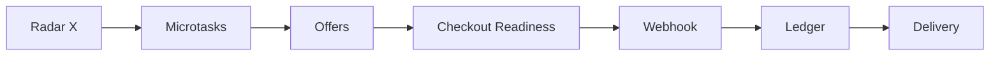

# GXEON Monetization Path

## Caminho operacional

## Etapas

1. **Radar X:** captura oportunidades, dores, demandas e sinais de mercado.
2. **Microtasks:** quebra oportunidade em tarefas pequenas, vendáveis ou executáveis.
3. **Offers:** transforma pacote de valor em proposta clara.
4. **Checkout readiness:** prepara cobrança, termos, entrega e suporte, sem ativar provider sem segurança.
5. **Webhook:** registra eventos de pagamento apenas quando provider estiver configurado e validado.
6. **Ledger:** mantém registro verificável de receita, custos, status e entrega.
7. **Delivery:** comprova entrega com evidência segura.

## Política contra receita fabricada

GXEON não deve registrar, divulgar ou usar como prova qualquer receita, cliente, pagamento ou conversão sem evidência real. Estimativas precisam ser rotuladas como projeções.

## Mercado Pago and Stripe future path

Mercado Pago e Stripe fazem parte do caminho futuro de checkout e webhooks. Ativação exige credenciais backend-only, ambiente correto, webhooks validados, logs seguros, rollback e ledger auditável.
